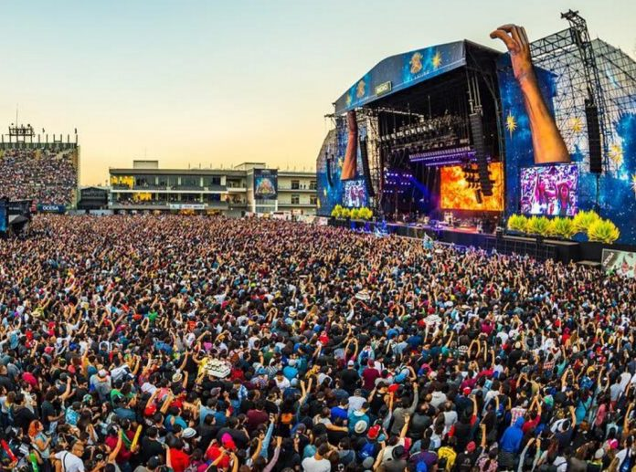

## Antes de empezar: algunos consejos

El enunciado tiene **mucha** información, van a necesitar leerlo varias veces. La sugerencia es que lo lean entero una vez (para tener una idea general) y luego vuelvan a consultarlo las veces que hagan falta.

En otras palabras: trabajen completando cada sección antes de pasar a la siguiente, con los tests que aseguran que funciona incluidos. Si al avanzar en las secciones les parece necesario refactorizar, adelante, van a tener los tests que garantizan que no rompieron nada. :smirk:

## Villa Tesei Fest 2022

La organizacion del Villa Tesei Fest 2022 le pidio a la facu si podía ayudar a diseñar la app para acceder y disfrutar de los eventos.

Por si todavía queda alguien que no lo conoce el Villa Tesei es un festival de música, entretenimiento y gastronomía que se celebra en Tesei con la visita de artistas nacionales e internacionales.

Desde las 15 hs y hasta las 3 am del día siguiente sus tres escenarios ofrecen espectáculos de música tropical, rock y trap durante todo el día del festival. Entre los escenarios hay mesas y zonas para sentarse y pasar el rato con otros participantes.

Entre los 3 escenarios está el patio de food trucks donde los asistentes pueden acceder a una oferta gastrónomica y de bebidas.

La aplicación permite al participante ingresar, acceder a las zonas vips de los escenarios y pagar las comidas y bebidas.

## 1. Acceso

La entrada es libre y gratuita... siempre que instalés la app y lo cuentes en tus redes sociales.

Al registrarse nos interesa conocer la edad del participante, su cuenta de instagram y su número de celular y 3 artistas del lineup que le interesan.

A su vez para hacerlo más divertido, y cobrar más, se ofrecen 3 niveles para tu acceso: fan, re-fan y super-fan.

- El o la __fan__ puede acceder a la zona vip de sólo uno de los 3 escenarios.
- Además de eso las y los __re-fan__ pueden acceder a la zona vip de un escenario más.
- Por último quien es __super-fan__ puede entrar a las 3 zonas vips.

Al ingresar podes adquirir tu acceso especial pagando 1000, 2000 o 3000 pesos. También podés obetenerlo consumiendo en los food trucks por 1000, 2000 o 3000 pesos respectivamente.

Al ingresar al festival los asistentes muestran la pantalla de la app con un QR y un scanner determina si puede acceder al predio. Para acceder a las zonas vips también se scannea el QR para ver si el participante puede acceder. Al ingresar se registra la hora que accedio.

- Luis solo instaló la app y se registró. Cada vez que intenta acceder a una zona vip el scanner lo rechaza.
- Juan es rockero sacó la entrada de fan, por lo que sólo puede acceder a una zona vip.
- René es fan de la cumbia y se copó con el trap. Upgradeo su entrada re-fan por lo que debería poder acceder a 2 zonas vips.
- A Laura le encanta la música y quiere acceder a las tres zonas vips. Sacó la entrada super-fan por lo que puede entrar cuando quiera a la zona vip que quiera.

## 2. Artistas y escenarios

Cada escenario tiene una lista de artistas y la hora a la que están programados. Las horas se pueden representar como 0 para las 15, 1 para las 16 y así hasta llegar a las 11 para las 2 am, última hora.

Cada participante al registrarse selecciona 3 artistas favoritos y la aplicacion deberá informarle para una hora cual es el próximo escenario donde tocará alguno de los artistas que dijo que le interesaban.

## 3. Bebidas y comidas

Si gustan de comer o tomar algo, la aplicacion permite listar el menu de los distintos food trucks y realizar pedidos. Luego se acercan al food truck y pagan. La venta de bebidas alcoholica está permitida, pero con restricciones. Las bebidas con cierto porcentaje de alcohol. Al registrarse una venta, se registra la hora y la canitdad de cc de alcohol comprados.

Los menores de 18 no pueden comprar alcohol bajo ninguna condición.

La cerveza y el vermut tienen alrededor de 6%. El vino, el gin tonic, campari, el fernet con cola rondan el 14%. El wiski, la ginebra, tequila y el vodka están alrededor del 40%. Si cada vaso tiene 400 cc, aproximadamente tenemos 24 cc de alcohol en la cerveza, 56 cc en el vino y 80 cc en los vasos de 200 cc de las bebidas más fuertes.

Las bebidas disponibles son:

|bebida|volumen del vaso|  %vol alcohol   |
|:----:|:--------------:|:---------------:|
|agua|500|        0        |
|gaseosa|354|        0        |
|cerveza|400|       0.5       |
|vermut|400|       0.7       |
|vino blanco|400|      11.0       |
|vino tinto|400|      14.0       |
|tragos (fernet con coca, campari, gin tonic,mojito)|400|      14.0       |
|bebidas fuertes (wiski, ginebra, tequila, vodka)|200|      40.0       |

Como medida precautoria no se le expende más 80 cc en las últimas dos horas a un participante.

Por ejemplo:

- Juan llegó recién y no tomó nada, compra una ginebra y se registra la hora. Al ver el menú no debería ver ninguna bebida alcoholica hasta dentro de 2 horas.
- René se tomó una cerveza hace 1 hora y media, otra cerveza hace 40 minutos y quiere pedir un vino. Al abrir el menú solo debería ver la cerveza o el vermuth
- Laura se tomo una cerveza hace 1 hora, el menú debería listarle la cerveza y el vermut.

El menú de comida incluye: choripanes, hamburguesas, bondiola, choripan vegano, hamburguesas veganas, bondiola vegana, nachos, papas fritas.

A la organización le interesa saber cuales la proporción de participantes que solo consumieron alimentos vegetarianos para mejorar la oferta para próximas ediciones.

Cuando el asistente realiza un consumo se registra el monto en su cuenta y si alcanza la cantidad correspondiente se promueve su acceso a alguno de los 3 accesos especiales.

## 4. Estadísticas

La organización quiere saber saber cuántos accesos vendió, cuanto se vendió en total en el predio y cuál fue el promedio por usuario que vendió.

También le gustaría saber cuál es la zona VIP más concurrida.

Otro indicador importante es cual fue el promedio de cc de alcohol de los participantes que tomaron bebidas alcoholicas. Cuál fue el porcentaje de asistentes que llegaron a los 80cc.  Además de qué proporción no tomo nada de alcohol.

A su vez se quiere saber cuál fue la bebida más consumida total y cual fue la bebida más vendida en cada hora.

Otra pregunta interesante es saber si dos personas tienen la misma onda. Tienen la misma onda si accedieron al menos a una zona vip a la misma hora respectivamente o eligieron 2 artistas en común.

Por ejemplo tienen la misma:

- René y Laura, ya que ingresaron a la zona de Trap a las 20 y a la zona tropical a las 22 hs.
- Juan y René, porque son fanáticos de "Joya Nunca Taxi" y "Sumados"

## Licencia

Esta obra fue elaborada por [Miguel Carboni](https://github.com/miguelius) y publicada bajo una [Licencia Creative Commons Atribución-CompartirIgual 4.0 Internacional][cc-by-sa].

[![CC BY-SA 4.0][cc-by-sa-image]][cc-by-sa]

[cc-by-sa]: https://creativecommons.org/licenses/by-sa/4.0/deed.es
[cc-by-sa-image]: https://licensebuttons.net/l/by-sa/4.0/88x31.png

### Créditos

:memo: [Enunciado original - Oktubrefest](https://objetos1wollokunq.gitlab.io/material/guia9-integradores.pdf) creado por [Carlos Lombardi](https://github.com/clombardi) y [Leonardo Gassman](https://github.com/lgassman).

:camera_flash: Imagen de portada por <a href="https://indiehoy.com/recitales/los-10-mejores-festivales-musica-mexico/">Los 10 mejores festivales de música en México</a>.
